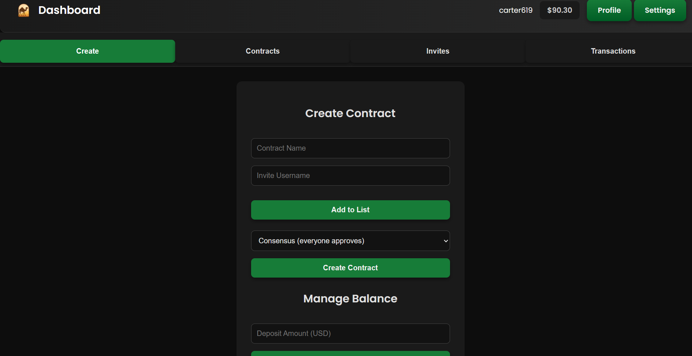
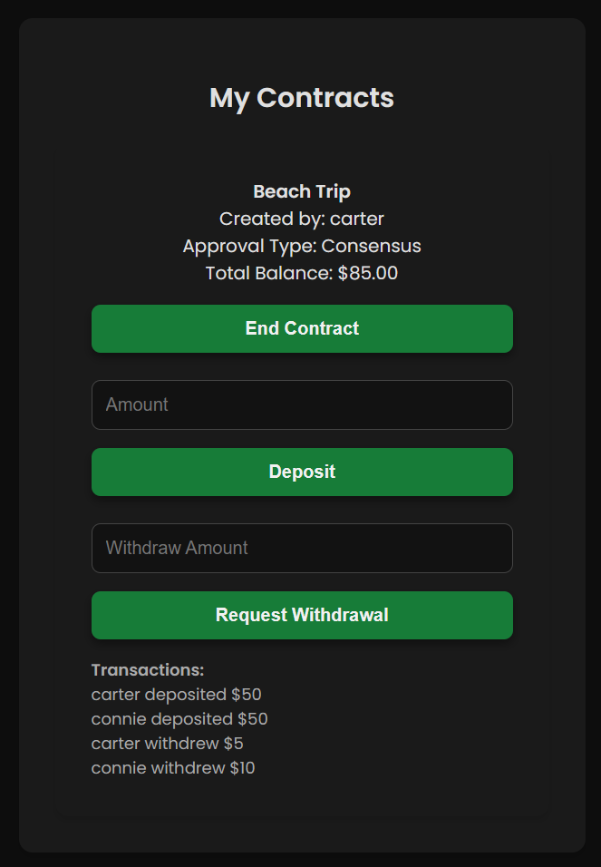

# CashCamel

Status: Completed web application

I built CashCamel as a Firebase web app for friend-group contracts, deposits, withdrawals, Google sign-in, and agreement-based release workflows.

## Overview

I built the app as a small escrow-style tool for groups. Users could create a contract, record deposits, review withdrawal history, and require agreement before funds were marked as released.

## Features

- Google sign-in
- contract creation workflow
- user balances
- deposit and withdrawal tracking
- agreement state before release
- Firebase hosting and database-backed state

## Implementation

I used Firebase hosting, database storage, Google authentication, and JavaScript. The main workflow centered on creating a contract, tracking participant state, and showing the agreement history clearly enough that users could understand what had happened inside a group.

## What I Learned

This project helped me work through real product-state problems: user identity, balances, contract status, payment-like flows, history views, and agreement logic. It also gave me more experience connecting a front-end interface to Firebase services without needing a separate always-on server.

## Portfolio

Portfolio page: [CashCamel](https://wchowellarchive.web.app/Projects/CashCamel/CashCamel.html)

Live site: [CashCamel.web.app](https://CashCamel.web.app)
